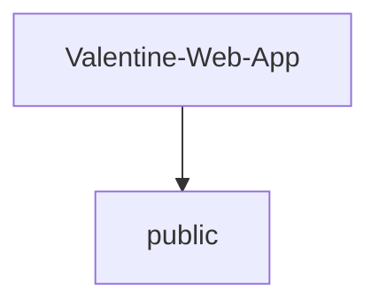
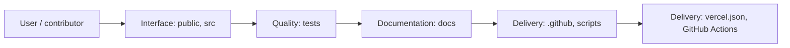
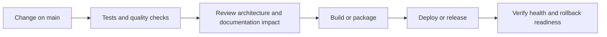
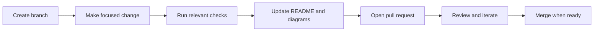
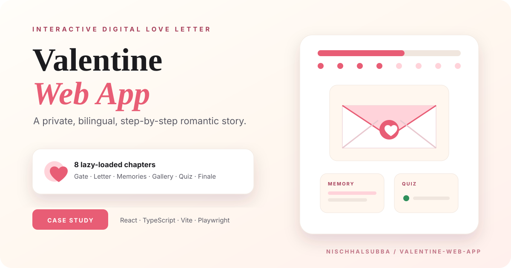

<!-- interactive-readme-standard:start -->

<div align="center">

# Valentine-Web-App

**Branch-aware technical guide for [`main`](https://github.com/Nischhalsubba/Valentine-Web-App/tree/main)**

<p>       </p>

<p>
  <a href="https://github.com/Nischhalsubba/Valentine-Web-App/tree/main"><strong>Browse source</strong></a> ·
  <a href="https://github.com/Nischhalsubba/Valentine-Web-App/issues"><strong>Issues</strong></a> ·
  <a href="https://github.com/Nischhalsubba/Valentine-Web-App/codespaces/new?ref=main"><strong>Open in Codespaces</strong></a>
</p>

</div>

> [!IMPORTANT]
> This guide is generated from the files actually present on `main`. It links to detected source paths, preserves project-authored notes, and avoids claiming components that were not found.

## At a glance

| Item | Detected value |
|---|---|
| Purpose | A private, bilingual, multi-step digital love-letter experience built with React, TypeScript, Vite, accessible motion, persistent progress, interactive memories, a relationship quiz, and a hold-to-reveal finale. |
| Branch role | Default branch |
| Stack | React, Vite, TypeScript, JavaScript, HTML, CSS |
| Manifests | package.json |
| Prerequisites | Node.js |
| Delivery | vercel.json, GitHub Actions |
| License | No license file detected |

## Branch scope

This is the repository's default branch.


## Quick start

```bash
npm install
npm run dev
npm run build
npm run typecheck
npm run preview
```

### Configuration surface

- `.env.example`

> Never commit secrets, private keys, production credentials, customer data, or unredacted infrastructure details.

## Repository map

```mermaid
flowchart TD
    ROOT["Valentine-Web-App / main"]
    ROOT --> P0[".github/"]
    ROOT --> P1["docs/"]
    ROOT --> P2["public/"]
    ROOT --> P3["scripts/"]
    ROOT --> P4["src/"]
    ROOT --> P5["tests/"]
    ROOT --> P6[".env.example"]
    ROOT --> P7["AGENTS.md"]
    ROOT --> P8["index.html"]
    ROOT --> P9["package-lock.json"]
    ROOT --> P10["package.json"]
    ROOT --> P11["playwright.config.ts"]
    ROOT --> P12["tsconfig.json"]
    ROOT --> P13["tsconfig.node.json"]
    ROOT --> P14["tsconfig.node.tsbuildinfo"]
    ROOT --> P15["tsconfig.tsbuildinfo"]
    ROOT --> P16["vercel.json"]
    ROOT --> P17["vite.config.d.ts"]
    ROOT --> MORE["+ 2 more top-level entries"]
```



| Responsibility | Detected source paths |
|---|---|
| Interface | [`public`](https://github.com/Nischhalsubba/Valentine-Web-App/tree/main/public), [`src`](https://github.com/Nischhalsubba/Valentine-Web-App/tree/main/src) |
| Quality | [`tests`](https://github.com/Nischhalsubba/Valentine-Web-App/tree/main/tests) |
| Documentation | [`docs`](https://github.com/Nischhalsubba/Valentine-Web-App/tree/main/docs) |
| Delivery | [`.github`](https://github.com/Nischhalsubba/Valentine-Web-App/tree/main/.github), [`scripts`](https://github.com/Nischhalsubba/Valentine-Web-App/tree/main/scripts) |

## Website or application map



## Architecture and responsibility flow




## Quality, security, and operations

<table>
<tr>
<td width="33%" valign="top">

### Quality

- [`tests`](https://github.com/Nischhalsubba/Valentine-Web-App/tree/main/tests)

Detected commands:
- `npm run dev`
- `npm run build`
- `npm run typecheck`
- `npm run preview`

</td>
<td width="33%" valign="top">

### Security

- No dedicated security policy or automated dependency configuration was detected.

Review authentication, authorization, input validation, dependency updates, secret handling, and failure recovery before release.

</td>
<td width="34%" valign="top">

### Observability

- No dedicated observability integration was detected automatically.

Define useful logs, metrics, traces, alerts, and rollback signals for production-facing branches.

</td>
</tr>
</table>

## Delivery flow



### Automation detected

- [`.github/workflows/apply-interactive-readme.yml`](https://github.com/Nischhalsubba/Valentine-Web-App/blob/main/.github/workflows/apply-interactive-readme.yml)

## Contribution flow



- Keep changes focused and explain architectural consequences.
- Run the checks relevant to the changed area.
- Update diagrams whenever routes, modules, data models, authentication, jobs, or delivery paths change.
- Add screenshots or recordings for visual behavior changes when useful.
- Use issues for reproducible defects and pull requests for reviewable changes.

## Ownership and support

| Topic | Source |
|---|---|
| Repository | [`Nischhalsubba/Valentine-Web-App`](https://github.com/Nischhalsubba/Valentine-Web-App) |
| Branch | [`main`](https://github.com/Nischhalsubba/Valentine-Web-App/tree/main) |
| Ownership | No CODEOWNERS file detected |
| Contributing | Use the contribution flow above |
| Support | [Open or review issues](https://github.com/Nischhalsubba/Valentine-Web-App/issues) |
| License | No license file detected |

<details>
<summary><strong>Documentation maintenance checklist</strong></summary>

- [ ] Purpose and branch scope are accurate.
- [ ] Setup and configuration commands still work.
- [ ] Repository, application, API, data, authentication, job, and deployment diagrams match the code.
- [ ] Tests, security controls, observability, and rollback behavior are documented.
- [ ] Links point to real files on this branch.
- [ ] No secrets or private operational details are exposed.

</details>

<!-- interactive-readme-standard:end -->

<!-- project-authored-notes:start -->
<details>
<summary><strong>Project-authored notes preserved from this branch</strong></summary>

<div align="center">



# Valentine Web App

### A private, bilingual digital love letter told in eight interactive chapters

A cinematic React experience combining a private gate, envelope reveal, letters, memories, gallery moments, playful questions, promises, and a hold-to-reveal finale.

[Live demo](https://valentine-web-app-seven.vercel.app/) · [Engineering case study](./docs/PRODUCT_AND_ENGINEERING_CASE_STUDY.md) · [Repository instructions](./AGENTS.md)


</div>

## Product concept

Valentine Web App is designed as a small emotional product rather than a single greeting page. The experience controls pacing across anticipation, reading, memory, play, promises, and reward.

The app supports:

- English, Nepali, and mixed-language modes
- soft, funny, and romantic mood modes
- system, reduced, and full-motion preferences
- persistent progress and unlock state in local storage
- a private phrase/PIN gate
- lazy-loaded chapters with fallback rendering
- next-step prefetching for smoother transitions
- accessible reduced-motion behavior
- Playwright end-to-end testing

## Story flow

| Step | Component | Experience |
|---|---|---|
| 1 | `StepCover` | Envelope reveal and introduction |
| 2 | `StepLetter` | Main love-letter reading experience |
| 3 | `StepMemory` | Timeline and memory exploration |
| 4 | `StepGallery` | Visual memory collection |
| 5 | `StepNurse` | Personalized themed chapter |
| 6 | `StepQuiz` | Interactive relationship questions |
| 7 | `StepPromises` | Promise and commitment sequence |
| 8 | `StepFinale` | Hold-to-reveal ending and rewards |

## Architecture

```text
src/
├── animations/     motion orchestration and reusable tokens
├── components/     shared controls, shells, dialogs, and widgets
├── content/        editable story data
├── hooks/          reduced-motion and shared behavior
├── steps/          eight lazy-loaded chapters
├── types/          app and content contracts
├── utils/          localization and storage helpers
├── App.tsx         gate, progress, settings, persistence, routing
└── styles.css      visual system and component styling
```

`App.tsx` acts as the experience controller. It reads the story content, manages the gate, stores settings and progress, loads each chapter lazily, prefetches the next chapter, and supplies shared actions to each step.

## Design system

The visual system is defined primarily in `src/styles.css`:

- warm paper background: `#fff7ef`
- rose accent: `#e85d75`
- soft blush accent: `#ffd3da`
- dark text: `#1b1b1f`
- Playfair Display for emotional headings
- Inter for interface and body copy
- reusable radius, spacing, shadow, duration, and easing tokens

The repository thumbnail uses the same system and is a designed presentation asset, not a browser screenshot.

## Privacy model

The gate is a lightweight experience gate, not secure authentication.

- accepted phrases are delivered to the browser
- unlock state is stored in local storage
- the gate should not protect sensitive information
- personal content and media should be reviewed before public deployment
- private media should not be hosted in publicly accessible folders when confidentiality matters

## Current status

| Area | Status |
|---|---|
| Eight-step story experience | Implemented |
| English/Nepali/mixed copy | Implemented |
| Mood controls | Implemented |
| Reduced-motion controls | Implemented |
| Persistent progress | Implemented |
| Private gate | Implemented as client-side deterrent |
| Lazy loading and fallback | Implemented |
| Playwright configuration | Present |
| Vercel deployment | Configured |
| Strong authentication | Not implemented |
| Browser screenshot in this documentation pass | Not captured |

The listed Vercel deployment could not be reached from the current execution environment, so no fabricated runtime screenshot has been added. Humanity will survive one less misleading portfolio image.

## Run locally

Requirements:

- Node.js 22 or newer
- npm 10 or newer

```bash
npm ci
npm run dev
```

Verification:

```bash
npm run check
npx playwright install chromium
npm run test:e2e
npm run preview
```

## Content customization

Edit the main story source:

```text
src/content/content.json
```

Key groups include:

- metadata and settings
- access gate
- cover and letter
- memories and gallery
- quiz and feedback
- promises
- finale and rewards
- easter eggs

Keep personal copy out of component logic whenever possible.

## Deployment

The project is configured for Vercel.

Typical deployment flow:

1. Push changes to `main`.
2. Vercel installs with the lockfile.
3. TypeScript and Vite build the app.
4. The static output is deployed.
5. Verify the gate, progress persistence, media, and all eight chapters on production.

## Important risks

- client-side gate values are discoverable
- local-storage progress can be cleared or modified
- emotional/personal content may be exposed by a public deployment
- multiple animation libraries increase bundle and maintenance cost
- chapter media can create privacy, performance, and copyright issues
- motion-rich flows require reduced-motion and keyboard testing
- a live romantic experience still deserves ordinary engineering discipline, despite what greeting-card companies have taught society

## Documentation

- [Product and engineering case study](./docs/PRODUCT_AND_ENGINEERING_CASE_STUDY.md)
- [Repository instructions](./AGENTS.md)
- [Branded repository thumbnail](./docs/assets/valentine-web-app-thumbnail.svg)

## Author

Designed and developed by [Nischhal Raj Subba](https://github.com/Nischhalsubba).

</details>
<!-- project-authored-notes:end -->
