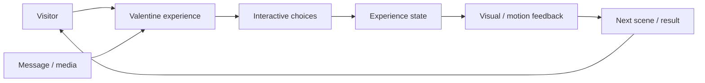
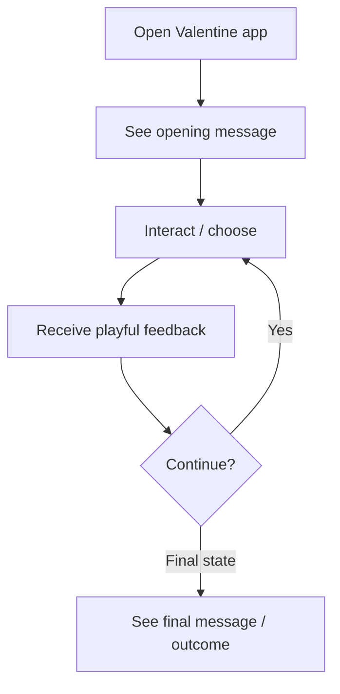
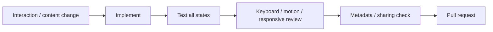

<div align="center">

# Valentine Web App

**An interactive Valentine-themed web experience focused on playful presentation, responsive interaction, clear feedback, and a memorable user journey.**


[Browse source](https://github.com/Nischhalsubba/Valentine-Web-App/tree/main) · [Issues](https://github.com/Nischhalsubba/Valentine-Web-App/issues)

</div>

## Overview

**Valentine Web App** is documented as a small interactive experience. The important architecture is the relationship between presented content, user choices, interaction state, animation/feedback, and the resulting experience rather than the number of files involved.

<details open>
<summary><strong>🏗️ Interactive experience architecture</strong></summary>



</details>

## Experience flow



## Audience guide

| Audience | Focus |
|---|---|
| Visitors | A simple, delightful interaction |
| Developers | State, event handling, animation and responsive behavior |
| Designers | Emotional pacing, hierarchy, motion, feedback and accessibility |
| Content owners | Message accuracy, media, tone and sharing metadata |

## Getting started

```bash
git clone https://github.com/Nischhalsubba/Valentine-Web-App.git
cd Valentine-Web-App
```

Use the manifests and lockfiles committed in the repository to determine the current runtime and development commands.

## Design & accessibility

Playful interactions should remain operable with keyboard/touch input, avoid motion that ignores reduced-motion preferences, preserve readable contrast, provide clear focus, and avoid interaction traps. The experience should still make sense if animation is reduced or unavailable.

## SEO & discoverability

If publicly shared, use an accurate title and description with natural terms such as **Valentine web app, interactive Valentine page, Valentine's Day web experience, and Valentine message**. Add social-preview metadata because this kind of project is more likely to be shared than discovered through a twelve-page procurement funnel, mercifully.

## Contribution flow


